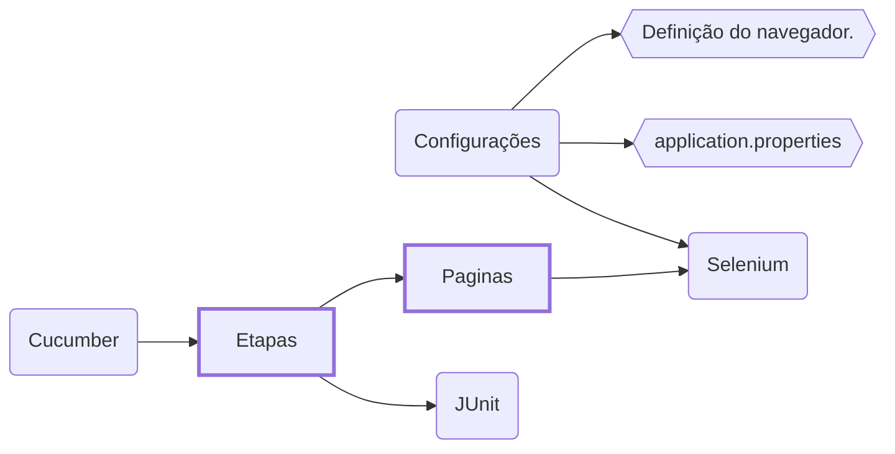

**_Resumidamente o enunciado pede um projeto [Java](https://www.java.com/pt-BR) baseado em [Cucumber](https://cucumber.io) ou [Serenity BDD](https://github.com/serenity-bdd)._**

_A descrição do desafio se encontra no arquivo **[Desafio Automação.pdf](https://github.com/ivone-olbi/desafios-b3/blob/main/documentos/Desafio%20Automa%C3%A7%C3%A3o.pdf)**._

> **ATENÇÃO**: o 2º cenário apresenta erro nos testes e portanto _nos scripts_ de propósito, de acordo com o que foi passado no desafio.

#### Arquitetura

_Para esse projeto, foi usado o padrão **Page Object**, que basicamente modela as páginas como objetos chamados de **Page Objects**._
_No resumo, cada classe com o sufixo "**Pagina**" representa uma página WEB. Que é utilizada por uma ou mais "**Etapas**" do **[Cucumber](https://cucumber.io)**._



_Exemplo da mesma arquitetura em **[Cypress](https://www.cypress.io/)**:_

_As funcionalidades da página WEB estão isoladas em uma classe separada que a representa._
```javascript
// Representa a página WEB de login.
class login {
    usuario = () => cy.get('#user-name')  
    senha   = () => cy.get('#password')
    entrar  = () => cy.get('#login-button')
}

export default login
```
_Ao escrever os cenários utilizamos as "páginas" representadas pelas classes._
```javascript
// Representa um cenário hipotético de login.
import Login from './login.cy.js'

describe('Realizar login.', () => {
  const login = new Login()

  // Login do usuário "performance_glitch_user".
  it('Given "performance_glitch_user".', () => {

    cy.visit('https://www.saucedemo.com')

    login.usuario().type('performance_glitch_user')
    login.senha().type('secret_sauce')
    login.entrar().click()

  })

})
```

#### Configuração do Projeto

1. _realize o `git clone` do projeto;_
2. _importe o projeto como "projeto [Maven](https://maven.apache.org)" na sua IDE favorita;_
3. _**[[Eclipse IDE]](https://www.eclipse.org/ide)** configure o "plugin do [Project Lombok](https://projectlombok.org)";_
4. _**[[Eclipse IDE]](https://www.eclipse.org/ide)** instale o "plugin do Cucumber":_  
   `Help >> Eclipse Marketplace... >> Cucumber Eclipse Plugin`;
   
#### Imagens:
1. _Configuração do **GitHub Actions**._
  
2. _**Relatório HTML default** ([clique aqui para ver](https://github.com/ivone-olbi/desafios-b3/blob/main/documentos/Cucumber%20Reports.html)), gerado pelo **Cucumber**. Para gerar o mesmo execute o comando: `mvn test`._  
   