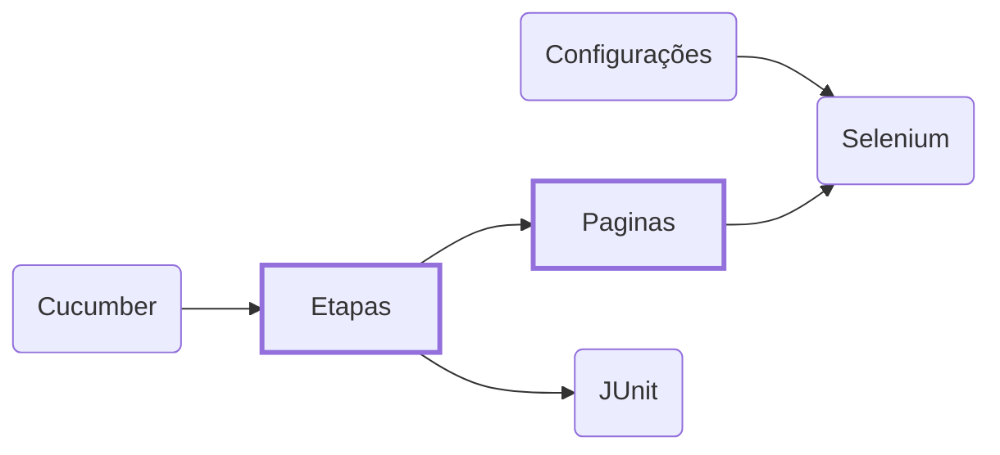

#### Desafio

_A linguagem de programação deve ser feita em Java 8/11 e o framework ([Cucumber](https://cucumber.io) ou [Serenity BDD](https://github.com/serenity-bdd))._

_Lembrando que o objetivo da prova, é que você possa expor o seu conhecimento de automação 
de testes. Conceitos como arquitetura de automação de testes, orientação a objetos, design 
patterns e clean code serão avaliados._

**Pré-Condições:**  

Caso de teste 1: _(realizar uma compra com sucesso.)_
1. Acessar o site: `https://www.saucedemo.com`;
2. Entrar com o usuário `performance_glitch_user`;
3. Na tela de produto, ordenar os produtos `NAME Z TO A`;
4. Selecionar um produto;
5. Adicionar no carrinho;
6. Realizar o checkout;
7. Finalizar a compra;

**Caso de teste 2:** _(tentativa da realização de uma compra.)_
1. Acessar o site: `https://www.saucedemo.com`;
2. Entrar com o usuário `problem_user`;
3. Adicionar no carrinho;
4. Realizar o checkout;

---

#### Arquitetura

_Para esse projeto, foi usado o padrão **Page Object**, que basicamente modela as páginas como objetos chamados de Page Objects._
_No resumo, cada classe com o sufixo "Pagina" representa uma página WEB. Que é utilizada por uma ou mais etapas do **[Cucumber](https://cucumber.io)**._

#### Configuração do Projeto

1. _realize o `git clone` do projeto;_
2. _importe o projeto como "projeto [Maven](https://maven.apache.org)" na sua IDE favorita;_
3. _**[[Eclipse IDE]](https://www.eclipse.org/ide)** configure o "plugin do [Project Lombok](https://projectlombok.org)";_
4. _**[[Eclipse IDE]](https://www.eclipse.org/ide)** instale o "plugin do Cucumber":_  
   `Help >> Eclipse Marketplace... >> Cucumber Eclipse Plugin`;